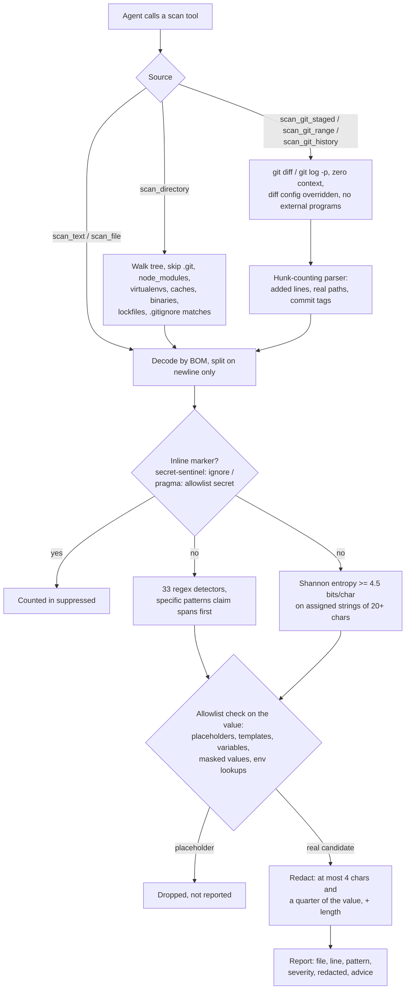

# mcp-secret-sentinel

<!-- mcp-name: io.github.AleBrito124356/mcp-secret-sentinel -->

[](https://github.com/AleBrito124356/mcp-secret-sentinel/actions/workflows/tests.yml)
[](pyproject.toml)
[](pyproject.toml)
[](LICENSE)

**MCP server and CLI that scans code for exposed secrets — API keys, tokens, private keys and high-entropy strings — with placeholder-aware allowlisting and redacted reports.**

Secrets rarely leak through hackers; they leak through commits. An agent (or a human in a hurry) pastes a webhook URL into a config, stages it, pushes — and from that moment the credential is compromised, even if the next commit deletes it, because history keeps every added line. mcp-secret-sentinel gives an agent a pre-commit checkpoint: scan a snippet, a file, a whole tree, the staged diff, the commits you are about to push, or recent history, and get back a severity-ranked, fully redacted report it can act on *before* anything leaves the machine. The full secret value never appears in the tool output, so it never enters the conversation transcript either.

## Tools

| Tool | Arguments | Returns |
|---|---|---|
| `scan_text` | `text`, `source_name="input"`, `max_findings=200` | Findings for a raw snippet (code, config, diff, logs) |
| `scan_file` | `path`, `max_findings=200` | Findings for one file; decodes UTF-8/16/32 by BOM, skips binaries (null-byte heuristic) and files over 5 MB |
| `scan_directory` | `path`, `max_files=500`, `max_findings=200` | Recursive scan; skips `.git`, `node_modules`, virtualenvs and conda envs under any name (found by `pyvenv.cfg` / `conda-meta`), `site-packages`, tool caches (`.tox`, `.nox`, `.mypy_cache`, `.pytest_cache`, `.ruff_cache`), `__pycache__`, `dist`, `build`, minified JS, lockfiles, and honors simple `.gitignore` patterns |
| `scan_git_staged` | `repo_path`, `max_findings=200` | Scans only the lines added in `git diff --cached` — the exact content the next commit would publish |
| `scan_git_range` | `repo_path`, `base="@{upstream}"`, `head="HEAD"`, `max_commits=200`, `max_findings=200` | Scans the commits in `base..head` — by default exactly what the next `git push` would publish. Adds `commits_scanned` and `range` to the report |
| `scan_git_history` | `repo_path`, `max_commits=50`, `all_branches=false`, `max_findings=200` | Scans lines added by the last N commits (of HEAD, or of every branch, tag and the stash), tagging each finding with its commit hash |
| `list_patterns` | — | Active detectors with severity and remediation advice, plus the allowlist rules |

Every tool is annotated read-only (`readOnlyHint`, no open-world access), so MCP clients can run it without a confirmation prompt.

All scan tools return the same shape:

```json
{
  "clean": false,
  "findings": [
    {
      "file": "config/notify.yaml",
      "line": 14,
      "pattern": "Slack incoming webhook",
      "severity": "high",
      "redacted": "hook…(77 chars)",
      "advice": "Anyone with this URL can post messages to your workspace. Regenerate the webhook in your Slack app settings and load the URL from an environment variable."
    }
  ],
  "files_scanned": 6,
  "summary": "Found 1 potential secret(s) across 6 scanned file(s): 1 high. Do NOT commit or push until these are removed or rotated."
}
```

`suppressed` is added when inline comments silenced findings (see below).

**Bounded responses.** A noisy tree used to return every finding. 3,000 hits made a 1 MB tool result that swamped the agent's context. Every scan tool now lists at most `max_findings` findings (default 200, most severe first, `0` = no limit). When it has to cut, the report says so and keeps the totals:

```json
{
  "clean": false,
  "findings": ["…the 200 most severe…"],
  "truncated": true,
  "total_findings": 3001,
  "counts_by_severity": {"critical": 1, "high": 3000},
  "counts_by_pattern": {"Generic secret assignment": 3000, "Stripe live key": 1},
  "top_files": [{"file": "fixtures/users.py", "findings": 3001}],
  "summary": "Found 3001 potential secret(s) … [listing the 200 most severe of 3001; see counts_by_severity, counts_by_pattern and top_files, or raise max_findings]"
}
```

### What it detects

Thirty-three regex detectors:

| Family | Detectors |
|---|---|
| Code hosting & packages | GitHub tokens (`ghp_` / `gho_` / `ghu_` / `ghs_` / `ghr_` and fine-grained `github_pat_`), GitLab tokens (`glpat-`, `glptt-`, `gldt-`, `glrt-`), npm access tokens (`npm_`), PyPI API tokens (`pypi-AgE…`) |
| AI providers | OpenAI (legacy `sk-…` plus project `sk-proj-`, service-account `sk-svcacct-` and admin `sk-admin-` keys), Anthropic, OpenRouter, Groq, NVIDIA, Hugging Face |
| Cloud | AWS access key IDs (`AKIA` / `ASIA`) and secret access keys, Azure storage account keys, Google API keys and OAuth client secrets, DigitalOcean tokens |
| SaaS | Stripe live keys, Shopify tokens, SendGrid keys, Twilio keys and account SIDs, Slack bot/user/app/refresh tokens and incoming webhooks, Discord webhooks, Telegram bot tokens |
| Keys & tokens | Private key blocks (RSA / EC / DSA / OPENSSH / PGP / encrypted), `age` secret keys, JWTs |
| Credentials in URLs | Database and queue connection strings (Postgres, MySQL/MariaDB, MongoDB, AMQP, Redis) and `http(s)`/`ftp`/`smtp` URLs with `user:password@` |
| Generic | `password` / `secret` / `api_key` / `token`-style assignments in quoted code, and dotenv-style `UPPER_CASE=value` lines |

On top of the regexes, a Shannon-entropy detector flags quoted strings of 20+ characters assigned to variables whose empirical entropy reaches **4.5 bits/char** — the signature of random credential material — but only when no specific pattern already claimed that span.

For credentials in URLs the reported value is the **password**, and the allowlist judges the password alone. A templated or look-alike host can no longer hide a literal password: `postgres://app:<literal>@${DB_HOST}/app` and `mysql://root:<literal>@db.examplecorp.net/prod` are both reported.

### What it deliberately ignores (allowlist)

Each candidate value is checked against these placeholder heuristics before being reported:

- **Too short** — values under 8 characters are too short to be real credentials.
- **Masked** — values that are mostly (≥ 80%) `X`, `x`, `*`, or dots: already redacted by a human, including vendor prefixes followed by an `XXXX…` run.
- **`example`** — any value containing `example` (any case), such as vendor-documented sample keys like the AWS docs key ending in `EXAMPLE`.
- **`placeholder`**, **`changeme`** (also `change-me` / `change_me`) — conventional fill-me-in markers.
- **your-…-here** — fill-in-the-blank markers.
- **`<angle brackets>`** — documentation-style placeholders.
- **`${TEMPLATE_VARIABLES}`** — the secret is injected elsewhere, not stored here.
- **Template expressions** — `{{ vault_db_password }}` (Jinja, Ansible, Helm, Go templates), ``, `<%= … %>` (ERB/EJS) and `#{…}` (Ruby).
- **Variable references** — a value that is only `$UPPER_CASE_VAR`, `$(command)`, PowerShell `$env:VAR` or cmd `%VAR%`. `$ecretP4ss` is still a password.
- **Format placeholders** — a value that is only `%(name)s` or `{name}`.
- **Environment lookups** — values referencing `os.environ` or `process.env`: an environment lookup is the fix, not the leak.
- **Code, for generic assignments only** — `API_SECRET = os.getenv("API_SECRET")`, `DB_PASSWORD = settings.DATABASE_PASSWORD`, `API_TOKEN = SECRETS[0]` or one side of `"password='" + pwd + "'"`. The rule is narrow on purpose (`"Xk9(pq!2Lm"` is still a password) and never applies to vendor formats such as JWTs, which contain dots.
- **Reserved documentation hosts** — a credentialed URL pointing at `example.com` / `.net` / `.org`, `*.example` or `*.invalid`.

### Inline suppression

A deliberate fixture or a known-safe line can be silenced where it lives, without renaming variables:

```python
TEST_DSN = "postgres://ci:ci-only-password@db:5432/test"  # secret-sentinel: ignore
```

detect-secrets' marker `pragma: allowlist secret` works too, so files already annotated for that tool need no changes. Markers are case-insensitive and cover only their own line, and they also apply to staged and committed lines. Suppressed findings are not hidden silently: the result carries `"suppressed": <count>` and says so in the summary.

### Encodings and line numbers

Files are decoded by byte-order mark (UTF-8, UTF-16 LE/BE, UTF-32) before the binary check, and BOM-less UTF-16 is recognised too. UTF-16 is what Windows PowerShell 5.1's `>` and `Out-File` write, so those files are now scanned instead of being skipped as binaries. Lines are split on `\n` only (a trailing `\r` is dropped). Form feeds, vertical tabs, `\x85`, U+2028 and U+2029 inside a line no longer shift the reported line numbers.

### Redaction guarantee

Every finding shows at most the first 4 characters, and never more than a quarter of the value, plus the total length: `"hook…(77 chars)"`, and `"Tr…(8 chars)"` for an 8-character password (0.1.0 showed half of it). The full value never appears in the output, the transcript, or the logs. This is enforced in code (a single `redact()` choke point) and in the test suite, which asserts the raw values are absent from serialized results, including over real MCP stdio.

### Git scans read the text, not your diff settings

The git tools parse `git diff` / `git log -p` output, and local git settings used to be able to change that output: an external diff tool (`diff.external`, difftastic and friends) replaced the diff entirely, so staged secrets were reported as *"no staged changes"* while the external program ran, and `diff.mnemonicPrefix`, `diff.noprefix` or quoted non-ASCII paths corrupted the reported file names. Every git call now:

- passes `--no-ext-diff --no-textconv --src-prefix=a/ --dst-prefix=b/ -U0 --inter-hunk-context=0 --no-color`;
- overrides `core.quotePath`, `core.fsmonitor`, `diff.noprefix`, `diff.mnemonicPrefix`, `diff.relative`, `diff.submodule`, `log.showSignature` and `log.showRoot` with `-c`;
- drops `GIT_EXTERNAL_DIFF` / `GIT_DIFF_OPTS` from the environment, sets `GIT_OPTIONAL_LOCKS=0`, and closes stdin;
- rejects revisions that start with `-`, so an agent-supplied `base` can never become a git option.

The diff parser is a state machine driven by the hunk line counts, so an added line that reads `+++ something` is content, never a file header. Binary files are named in the summary instead of being skipped silently.

## How it works



## Quickstart

The package is not on PyPI yet (the publish workflow runs when a `v*` tag is
pushed), so install it straight from GitHub. It runs on Python 3.10+ with
either major of the official MCP SDK (`mcp` 1.7+ or 2.x).

**Claude Desktop** (`claude_desktop_config.json`), with `uvx` fetching it from git:

```json
{
  "mcpServers": {
    "secret-sentinel": {
      "command": "uvx",
      "args": [
        "--from",
        "git+https://github.com/AleBrito124356/mcp-secret-sentinel",
        "mcp-secret-sentinel"
      ]
    }
  }
}
```

**Claude Code:**

```bash
claude mcp add secret-sentinel -- uvx --from git+https://github.com/AleBrito124356/mcp-secret-sentinel mcp-secret-sentinel
```

**Permanent install with pip** (no `uv` needed):

```bash
pip install "git+https://github.com/AleBrito124356/mcp-secret-sentinel"
```

Then use `mcp-secret-sentinel` as the command in any MCP client config.

## Command line, git hook and CI

The same scanner works without an MCP client. `mcp-secret-sentinel` with **no arguments still starts the stdio server**, so existing client configs are unchanged. With a command it becomes a CLI:

```bash
mcp-secret-sentinel scan                       # the current directory
mcp-secret-sentinel scan src config/app.yaml   # files and directories
git diff | mcp-secret-sentinel scan -          # stdin
mcp-secret-sentinel scan --staged              # what the next commit would add
mcp-secret-sentinel scan --range               # what the next push would publish (@{upstream}..HEAD)
mcp-secret-sentinel scan --range origin/main..HEAD
mcp-secret-sentinel scan --history 100 --all-branches
mcp-secret-sentinel scan --format sarif -o secrets.sarif
mcp-secret-sentinel patterns                   # detectors, allowlist rules, suppression markers
```

```text
$ mcp-secret-sentinel scan src
src/billing.py:2  [critical] Stripe live key  sk_l…(32 chars)
    Roll the key in the Stripe Dashboard (Developers -> API keys). Live keys grant access to real payment data.
src/notify.py:3  [high] Slack incoming webhook  hook…(69 chars)
    Anyone with this URL can post messages to your workspace. Regenerate the webhook in your Slack app settings and load the URL from an environment variable.

Found 2 potential secret(s) across 2 scanned file(s): 1 critical, 1 high. Do NOT commit or push until these are removed or rotated.
```

| Option | Meaning |
|---|---|
| `--format text\|json\|sarif` | Human report (default), the MCP JSON report, or SARIF 2.1.0 |
| `--fail-on critical\|high\|medium` | Lowest severity that makes the exit status 1 (default `medium`, i.e. any finding). Findings cut by `--max-findings` still count |
| `--max-findings N` | List at most N findings, most severe first (default 200; `0` = no limit; SARIF lists everything unless set) |
| `--max-files N` | Stop a directory scan after N files (default 5000) |
| `--max-commits N` | With `--range`: scan at most the N newest commits (default 200) |
| `-o, --output FILE` | Write the report to a file; the one-line summary goes to stderr |

**Exit status:** `0` clean (or only findings below `--fail-on`), `1` findings at or above `--fail-on`, `2` usage error (bad option, missing path, not a git repository, unknown revision). Paths in the report are relative to the working directory, which is what editors and SARIF viewers expect. With `--staged`, `--range` and `--history` they are relative to the repository root. Output is redacted in every format.

### Block commits with a git hook

```bash
mcp-secret-sentinel install-hook            # in the repository, or: install-hook path/to/repo
```

This writes `.git/hooks/pre-commit`, or the directory `core.hooksPath` points at. The hook runs `scan --staged` with the Python that installed it, so a commit is refused while its staged lines contain a secret, and `git commit --no-verify` skips it once. The installer never overwrites a hook written by another tool unless you pass `--force`, and then it keeps the old hook as `pre-commit.bak`. `--fail-on high` makes the hook ignore medium findings.

With the [pre-commit](https://pre-commit.com) framework, add this to `.pre-commit-config.yaml`:

```yaml
repos:
  - repo: https://github.com/AleBrito124356/mcp-secret-sentinel
    rev: main   # pin a commit SHA (or a v* tag once one is published)
    hooks:
      - id: secret-sentinel
```

### GitHub code scanning

`--format sarif` produces a SARIF 2.1.0 log (checked against the official JSON schema). It has one rule per detector with `security-severity`, a redacted message, a `startLine` per result and a stable fingerprint, so findings show up as code scanning alerts. A workflow step for your own repository:

```yaml
- run: pip install "git+https://github.com/AleBrito124356/mcp-secret-sentinel"
- run: mcp-secret-sentinel scan --format sarif -o secret-sentinel.sarif --fail-on critical
- uses: github/codeql-action/upload-sarif@v3
  if: always()
  with:
    sarif_file: secret-sentinel.sarif
```

## Example session

> **User:** I'm about to push acme-app — make sure I'm not leaking anything.
>
> **Claude** calls `scan_git_staged(repo_path="C:/dev/acme-app")`:
>
> ```json
> {
>   "clean": false,
>   "findings": [
>     {
>       "file": "config/notify.yaml",
>       "line": 14,
>       "pattern": "Slack incoming webhook",
>       "severity": "high",
>       "redacted": "hook…(77 chars)",
>       "advice": "Anyone with this URL can post messages to your workspace. Regenerate the webhook in your Slack app settings and load the URL from an environment variable."
>     }
>   ],
>   "files_scanned": 6,
>   "summary": "Found 1 potential secret(s) across 6 scanned file(s): 1 high. Do NOT commit or push until these are removed or rotated. Unstage the affected files and strip the secrets before committing."
> }
> ```
>
> **Claude:** Hold the push — `config/notify.yaml` line 14 contains a real Slack webhook URL in the staged diff. Three steps:
> 1. Replace the literal URL with an environment lookup, e.g. `SLACK_WEBHOOK_URL`.
> 2. Regenerate the webhook in your Slack app settings — treat the current one as compromised.
> 3. Re-stage the file and I'll verify.
>
> **User:** Done — check again.
>
> **Claude** calls `scan_git_staged(...)` → `"clean": true, "summary": "Staged changes are clean — 6 file(s) with additions scanned, no secrets in the added lines."` — commits, then calls `scan_git_range(repo_path="C:/dev/acme-app")` → `"clean": true, "commits_scanned": 3, "range": "@{upstream}..HEAD"`.
>
> **Claude:** Clean — the staged changes and the 3 commits your push would publish contain no detectable secrets. Safe to push.

## Limitations

- **`.gitignore` support is best-effort**: plain names, `*.ext` globs, `dir/` and `/anchored` patterns from the *root* `.gitignore` only. No `!` negations, no `**` globs, no nested ignore files.
- **Entropy needs diversity**: empirical per-string entropy maxes out at log2(distinct characters), so a candidate needs at least 23 distinct characters to clear 4.5 bits/char. Short random strings are covered by the regex detectors instead.
- **Unquoted generic assignments** are only detected in dotenv-style `UPPER_CASE=value` lines — a deliberate trade against false positives in ordinary code.
- **Line-by-line matching**: a secret split across lines (a PEM body, a string concatenated over several lines) is only caught by its first line, such as the `BEGIN PRIVATE KEY` header.
- **Inline suppression is same-line only**: a marker on the line above does nothing, because in a zero-context diff that line is usually not visible.
- **Merge commits are not diffed** (git's default for `git log -p`), so a secret introduced only while resolving a merge conflict is missed by `scan_git_range` and `scan_git_history`. `scan_git_staged` still sees it before the merge commit is made.
- **Binary files in git are not scanned**. That includes files that `.gitattributes` marks as binary or `-diff`; the summary lists them by name.
- **Not a CI replacement**: dedicated scanners (gitleaks, trufflehog) with hundreds of rules belong in your pipeline. This server is the fast local checkpoint an agent can run *before* the commit exists.

## Development

```bash
git clone https://github.com/AleBrito124356/mcp-secret-sentinel
cd mcp-secret-sentinel
pip install -e ".[dev]"
python -m pytest
```

From the source tree, `python -m mcp_secret_sentinel` runs the CLI (the MCP server with no arguments), and `python -m mcp_secret_sentinel.server` always runs the server.

The test suite never contains a realistic secret literal: every positive fixture is assembled at runtime by concatenation. A test scans this repository and requires it to be clean. The suite is organised as follows:

- `tests/test_core.py` and `tests/test_detection.py` cover every detector, the allowlist and placeholder syntaxes, entropy, redaction, encodings, line numbering, directory walking, inline suppression and a linear-time bound for long lines.
- `tests/test_git.py` uses real temporary repositories and a local bare remote. It checks diff configuration overrides (a marker file proves `diff.external` and textconv programs never run), path quoting, hunk parsing, `--all` and range scans.
- `tests/test_cli.py` runs the CLI as a subprocess: exit codes, `--fail-on`, JSON and SARIF, stdin, legacy console encodings, and `install-hook` blocking a real `git commit`.
- `tests/test_server.py` spawns the real server over stdio and drives it with the SDK's own `ClientSession`, so it proves the wiring on whichever SDK major is installed.

To check the other SDK major too:

```bash
python -m venv .venv-mcp1
.venv-mcp1/bin/pip install "mcp<2" -e ".[dev]"   # Windows: .venv-mcp1\Scripts\pip
.venv-mcp1/bin/python -m pytest
```

## Related MCP servers

Part of a family of small, dependency-light MCP servers:

- [mcp-decision-lab](https://github.com/AleBrito124356/mcp-decision-lab) — weighted decision matrices with sensitivity analysis
- [mcp-devils-advocate](https://github.com/AleBrito124356/mcp-devils-advocate) — stress-test a claim: devil's advocate, premortem, assumption audits
- [mcp-git-historian](https://github.com/AleBrito124356/mcp-git-historian) — churn hotspots, blame summaries, bus factor
- [mcp-memory-vault](https://github.com/AleBrito124356/mcp-memory-vault) — persistent memory with SQLite FTS5 search

## License

MIT
