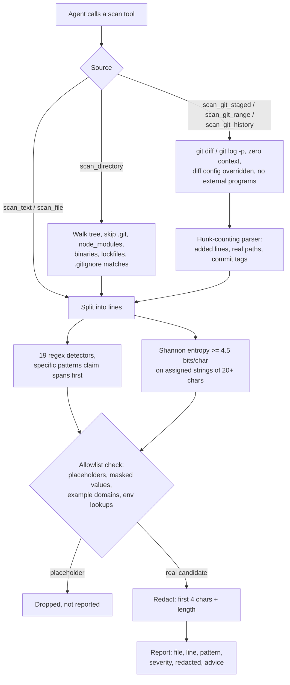

# mcp-secret-sentinel

<!-- mcp-name: io.github.AleBrito124356/mcp-secret-sentinel -->

[](https://github.com/AleBrito124356/mcp-secret-sentinel/actions/workflows/tests.yml)
[](pyproject.toml)
[](pyproject.toml)
[](LICENSE)

**MCP server that scans code for exposed secrets — API keys, tokens, private keys and high-entropy strings — with placeholder-aware allowlisting and redacted reports.**

Secrets rarely leak through hackers; they leak through commits. An agent (or a human in a hurry) pastes a webhook URL into a config, stages it, pushes — and from that moment the credential is compromised, even if the next commit deletes it, because history keeps every added line. mcp-secret-sentinel gives an agent a pre-commit checkpoint: scan a snippet, a file, a whole tree, the staged diff, the commits you are about to push, or recent history, and get back a severity-ranked, fully redacted report it can act on *before* anything leaves the machine. The full secret value never appears in the tool output, so it never enters the conversation transcript either.

## Tools

| Tool | Arguments | Returns |
|---|---|---|
| `scan_text` | `text`, `source_name="input"` | Findings for a raw snippet (code, config, diff, logs) |
| `scan_file` | `path` | Findings for one file; skips binaries (null-byte heuristic) and files over 5 MB |
| `scan_directory` | `path`, `max_files=500` | Recursive scan; skips `.git`, `node_modules`, virtualenvs, `__pycache__`, `dist`, `build`, minified JS, lockfiles, and honors simple `.gitignore` patterns |
| `scan_git_staged` | `repo_path` | Scans only the lines added in `git diff --cached` — the exact content the next commit would publish |
| `scan_git_range` | `repo_path`, `base="@{upstream}"`, `head="HEAD"`, `max_commits=200` | Scans the commits in `base..head` — by default exactly what the next `git push` would publish. Adds `commits_scanned` and `range` to the report |
| `scan_git_history` | `repo_path`, `max_commits=50`, `all_branches=false` | Scans lines added by the last N commits (of HEAD, or of every branch, tag and the stash), tagging each finding with its commit hash |
| `list_patterns` | — | Active detectors with severity and remediation advice, plus the allowlist rules |

Every tool is annotated read-only (`readOnlyHint`, no open-world access), so MCP clients can run it without a confirmation prompt.

All scan tools return the same shape:

```json
{
  "clean": false,
  "findings": [
    {
      "file": "config/notify.yaml",
      "line": 14,
      "pattern": "Slack incoming webhook",
      "severity": "high",
      "redacted": "hook…(77 chars)",
      "advice": "Anyone with this URL can post messages to your workspace. Regenerate the webhook in your Slack app settings and load the URL from an environment variable."
    }
  ],
  "files_scanned": 6,
  "summary": "Found 1 potential secret(s) across 6 scanned file(s): 1 high. Do NOT commit or push until these are removed or rotated."
}
```

### What it detects

Nineteen regex detectors: GitHub tokens (classic and fine-grained), OpenAI / Anthropic / NVIDIA / Google / Stripe (live) / Twilio keys, AWS access key IDs and secret access keys, Slack tokens and incoming webhooks, Discord webhooks, JWTs, private key blocks (RSA / EC / OPENSSH / PGP), database and queue connection strings with embedded credentials (Postgres, MySQL, MongoDB, AMQP, Redis), plus generic `password` / `secret` / `token`-style assignments in quoted code and in dotenv-style `UPPER_CASE=value` lines.

On top of the regexes, a Shannon-entropy detector flags quoted strings of 20+ characters assigned to variables whose empirical entropy reaches **4.5 bits/char** — the signature of random credential material — but only when no specific pattern already claimed that span.

### What it deliberately ignores (allowlist)

Each candidate value is checked against these placeholder heuristics before being reported:

- **Too short** — values under 8 characters are too short to be real credentials.
- **Masked** — values that are mostly (≥ 80%) `X`, `x`, `*`, or dots: already redacted by a human, including vendor prefixes followed by an `XXXX…` run.
- **`example`** — any value containing `example` (any case): covers `example.com` / `example.org` domains *and* vendor-documented sample keys, such as the AWS docs key ending in `EXAMPLE`.
- **`placeholder`**, **`changeme`** (also `change-me` / `change_me`) — conventional fill-me-in markers.
- **your-…-here** — fill-in-the-blank markers.
- **`<angle brackets>`** — documentation-style placeholders.
- **`${TEMPLATE_VARIABLES}`** — the secret is injected elsewhere, not stored here.
- **Environment lookups** — values referencing `os.environ` or `process.env`: an environment lookup is the fix, not the leak.

### Redaction guarantee

Every finding shows only the first 4 characters plus the total length — e.g. `"hook…(77 chars)"`. The full value never appears in the output, the transcript, or the logs. This is enforced in code (a single `redact()` choke point) and in the test suite, which asserts the raw values are absent from serialized results.

### Git scans read the text, not your diff settings

The git tools parse `git diff` / `git log -p` output, and local git settings used to be able to change that output: an external diff tool (`diff.external`, difftastic and friends) replaced the diff entirely, so staged secrets were reported as *"no staged changes"* while the external program ran, and `diff.mnemonicPrefix`, `diff.noprefix` or quoted non-ASCII paths corrupted the reported file names. Every git call now:

- passes `--no-ext-diff --no-textconv --src-prefix=a/ --dst-prefix=b/ -U0 --inter-hunk-context=0 --no-color`;
- overrides `core.quotePath`, `core.fsmonitor`, `diff.noprefix`, `diff.mnemonicPrefix`, `diff.relative`, `diff.submodule`, `log.showSignature` and `log.showRoot` with `-c`;
- drops `GIT_EXTERNAL_DIFF` / `GIT_DIFF_OPTS` from the environment, sets `GIT_OPTIONAL_LOCKS=0`, and closes stdin;
- rejects revisions that start with `-`, so an agent-supplied `base` can never become a git option.

The diff parser is a state machine driven by the hunk line counts, so an added line that reads `+++ something` is content, never a file header. Binary files are named in the summary instead of being skipped silently.

## How it works



## Quickstart

The package is not on PyPI yet (the publish workflow runs when a `v*` tag is
pushed), so install it straight from GitHub. It runs on Python 3.10+ with
either major of the official MCP SDK (`mcp` 1.7+ or 2.x).

**Claude Desktop** (`claude_desktop_config.json`), with `uvx` fetching it from git:

```json
{
  "mcpServers": {
    "secret-sentinel": {
      "command": "uvx",
      "args": [
        "--from",
        "git+https://github.com/AleBrito124356/mcp-secret-sentinel",
        "mcp-secret-sentinel"
      ]
    }
  }
}
```

**Claude Code:**

```bash
claude mcp add secret-sentinel -- uvx --from git+https://github.com/AleBrito124356/mcp-secret-sentinel mcp-secret-sentinel
```

**Permanent install with pip** (no `uv` needed):

```bash
pip install "git+https://github.com/AleBrito124356/mcp-secret-sentinel"
```

Then use `mcp-secret-sentinel` as the command in any MCP client config.

## Example session

> **User:** I'm about to push acme-app — make sure I'm not leaking anything.
>
> **Claude** calls `scan_git_staged(repo_path="C:/dev/acme-app")`:
>
> ```json
> {
>   "clean": false,
>   "findings": [
>     {
>       "file": "config/notify.yaml",
>       "line": 14,
>       "pattern": "Slack incoming webhook",
>       "severity": "high",
>       "redacted": "hook…(77 chars)",
>       "advice": "Anyone with this URL can post messages to your workspace. Regenerate the webhook in your Slack app settings and load the URL from an environment variable."
>     }
>   ],
>   "files_scanned": 6,
>   "summary": "Found 1 potential secret(s) across 6 scanned file(s): 1 high. Do NOT commit or push until these are removed or rotated. Unstage the affected files and strip the secrets before committing."
> }
> ```
>
> **Claude:** Hold the push — `config/notify.yaml` line 14 contains a real Slack webhook URL in the staged diff. Three steps:
> 1. Replace the literal URL with an environment lookup, e.g. `SLACK_WEBHOOK_URL`.
> 2. Regenerate the webhook in your Slack app settings — treat the current one as compromised.
> 3. Re-stage the file and I'll verify.
>
> **User:** Done — check again.
>
> **Claude** calls `scan_git_staged(...)` → `"clean": true, "summary": "Staged changes are clean — 6 file(s) with additions scanned, no secrets in the added lines."` — commits, then calls `scan_git_range(repo_path="C:/dev/acme-app")` → `"clean": true, "commits_scanned": 3, "range": "@{upstream}..HEAD"`.
>
> **Claude:** Clean — the staged changes and the 3 commits your push would publish contain no detectable secrets. Safe to push.

## Limitations

- **`.gitignore` support is best-effort**: plain names, `*.ext` globs, `dir/` and `/anchored` patterns from the *root* `.gitignore` only. No `!` negations, no `**` globs, no nested ignore files.
- **Entropy needs diversity**: empirical per-string entropy maxes out at log2(distinct characters), so a candidate needs at least 23 distinct characters to clear 4.5 bits/char. Short random strings are covered by the regex detectors instead.
- **Unquoted generic assignments** are only detected in dotenv-style `UPPER_CASE=value` lines — a deliberate trade against false positives in ordinary code.
- **Not a CI replacement**: dedicated scanners (gitleaks, trufflehog) with hundreds of rules belong in your pipeline. This server is the fast local checkpoint an agent can run *before* the commit exists.

## Development

```bash
git clone https://github.com/AleBrito124356/mcp-secret-sentinel
cd mcp-secret-sentinel
pip install -e ".[dev]"
python -m pytest
```

You can also run the server straight from the source tree with `python -m mcp_secret_sentinel.server`.

The test suite exercises every detector, the allowlist, entropy, redaction, directory walking, and real temporary git repositories — and never contains a realistic secret literal: every positive fixture is assembled at runtime by concatenation. `tests/test_server.py` spawns the real server over stdio and drives it with the SDK's own `ClientSession`, so it proves the wiring on whichever SDK major is installed. To check the other major too:

```bash
python -m venv .venv-mcp1
.venv-mcp1/bin/pip install "mcp<2" -e ".[dev]"   # Windows: .venv-mcp1\Scripts\pip
.venv-mcp1/bin/python -m pytest
```

## Related MCP servers

Part of a family of small, dependency-light MCP servers:

- [mcp-decision-lab](https://github.com/AleBrito124356/mcp-decision-lab) — weighted decision matrices with sensitivity analysis
- [mcp-devils-advocate](https://github.com/AleBrito124356/mcp-devils-advocate) — stress-test a claim: devil's advocate, premortem, assumption audits
- [mcp-git-historian](https://github.com/AleBrito124356/mcp-git-historian) — churn hotspots, blame summaries, bus factor
- [mcp-memory-vault](https://github.com/AleBrito124356/mcp-memory-vault) — persistent memory with SQLite FTS5 search

## License

MIT
